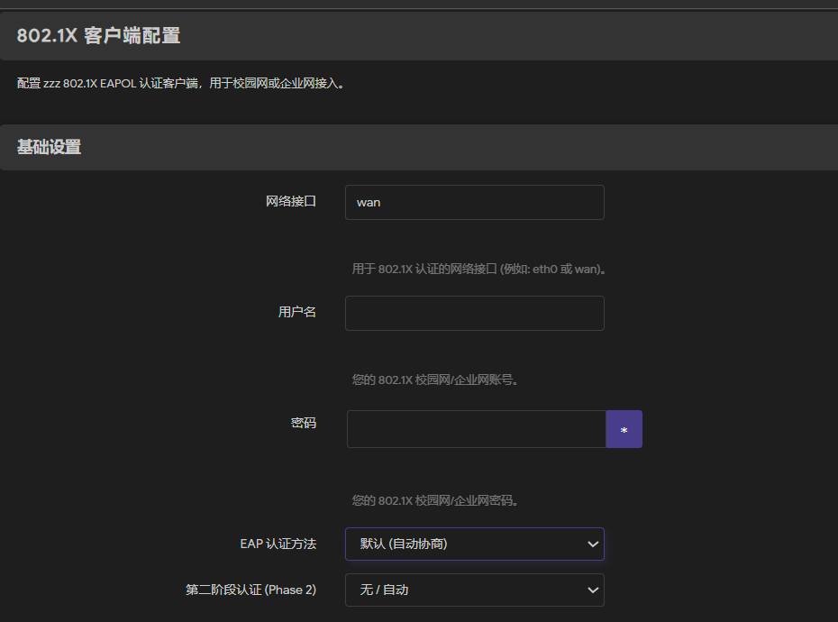

# luci-app-zzz

OpenWrt 的 LuCI 图形界面插件，用于配置和管理 [zzz](https://github.com/diredocks/zzz) —— 一个基于 802.1X EAPOL 协议的校园网/企业网认证客户端。

> 本项目基于 [diredocks/zzz](https://github.com/diredocks/zzz) 开发，为其提供 LuCI 管理界面并添加了统一ttl用于简单的防检测，并对 zzz-client 进行了针对性修改。感谢原作者的工作。

**已测试环境：（H3C iNode 802.1X 认证）**

---

## 功能

- 在 LuCI 界面中配置 802.1X 认证参数（网络接口、用户名、密码、EAP 方法等）
- 支持开机自动认证
- 支持手动启动/停止认证服务

---

## 安装


### 使用方法：fork 项目自行编译

见下方[自行编译](#自行编译)章节。

---

## 配置

安装完成后，在 LuCI 界面中进入 **服务 → 802.1X 客户端**，填写以下信息：



需根据具体的路由器型号选择wan口代号
可在openwrt中的 网络-接口中查看或在ssh中运行ip link show
填写完成后点击**保存并应用**，服务会自动启动并开始认证。

---

## 编译方法


### 1. Fork 本仓库

点击页面右上角的 **Fork** 按钮，将仓库复制到你自己的 GitHub 账号下。

### 2. 修改 SDK 版本

编辑 `.github/workflows/build.yml`，修改 SDK 下载链接以匹配你的路由器 OpenWrt 版本和架构：

```yaml
- name: Setup OpenWrt SDK
  run: |
    wget https://downloads.openwrt.org/releases/[版本]/targets/[架构]/[子架构]/openwrt-sdk-[...].tar.xz
```

SDK 下载地址可在 [OpenWrt 官方下载页面](https://downloads.openwrt.org/releases/) 查找，找到对应版本和架构的目录，下载文件名包含 `openwrt-sdk` 的压缩包。

### 3. 触发编译

有两种触发方式：

**自动触发**：向 `main` 分支 push 代码时自动编译。

**手动触发**：
1. 进入你 fork 的仓库，点击顶部 **Actions** 标签页
2. 左侧选择 **Build OpenWrt Package**
3. 点击 **Run workflow** → **Run workflow**

### 4. 下载编译产物

编译完成后，在对应的 workflow 运行记录页面底部的 **Artifacts** 中下载 `.ipk` 文件。

---

## 关于 zzz

[zzz](https://github.com/diredocks/zzz) 是一个轻量的 802.1X EAPOL 认证客户端，通过 `libpcap` 直接在链路层收发 EAPOL 帧，绕过内核协议栈实现认证，适合在 OpenWrt 等嵌入式 Linux 环境中运行。

本项目使用了 zzz 的核心认证逻辑，并在此基础上进行了修改以适配特定校园网环境。

---

## 免责声明

本项目仅供学习和个人使用，请遵守所在学校或机构的网络使用规定。
